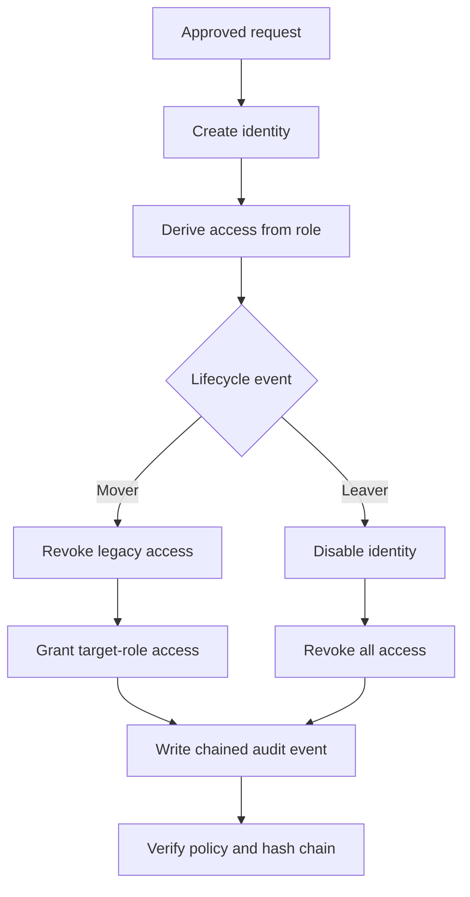

# IdentityShield

IdentityShield is a portfolio-grade identity and access management lab built around the joiner–mover–leaver lifecycle. It demonstrates how an IAM analyst can provision a user, replace legacy access during a role change, revoke access during offboarding, and produce evidence that the control operated correctly.

> This project uses synthetic identities and permissions. It is an educational security lab, not a production identity provider.

## Lab 01 — User Lifecycle Management

The working lifecycle lab includes:

- policy-based user onboarding with no direct entitlement grants;
- role transfers that calculate and display access additions and removals;
- revoke-before-grant enforcement during a transfer;
- account offboarding that disables the identity and removes all effective access;
- orphaned-permission detection after every lifecycle action;
- persistent identities, roles, permissions, and audit events;
- a SHA-256 hash chain that exposes audit-log modification;
- downloadable JSON evidence for portfolio demonstrations;
- responsive, keyboard-accessible controls and explicit destructive-action confirmation.

## Control Flow



## Security Decisions Demonstrated

| Control | Implementation |
| --- | --- |
| Least privilege | Users receive only the permission set defined by their role. |
| No access accumulation | A transfer replaces the old permission set instead of merging it. |
| Revoke before grant | Removed permissions are calculated and recorded before target access is applied. |
| Complete offboarding | Status, role assignment, and effective access are cleared together. |
| Access drift detection | Effective permissions are compared with the current role policy. |
| Audit integrity | Every event contains the previous event hash and its own SHA-256 digest. |
| Evidence retention | Offboarded users remain represented in the ledger without retaining access. |

## Architecture

- **Interface:** React 19 and Vinext
- **Application routes:** server-side lifecycle API
- **Persistence:** Cloudflare D1
- **Data access:** Drizzle ORM with generated SQL migrations
- **Integrity:** Web Crypto SHA-256 hash chaining
- **Deployment:** Cloudflare Worker-compatible server output

The main records are `roles`, `users`, and `audit_events`. Role permissions and effective user access are stored independently so the lab can detect entitlement drift.

## API Actions

`GET /api/identity-lab` returns the current identities, approved roles, recent audit events, integrity result, and control metrics.

`POST /api/identity-lab` supports:

- `add_user`
- `transfer_role`
- `offboard_user`

Every state-changing action performs server-side validation and writes a new chained audit event.

## Demonstration Scenario

1. Add a synthetic employee using an approved role.
2. Select the employee and move them to a different role.
3. Review the exact permissions removed and added.
4. Apply the transfer and confirm orphaned access remains zero.
5. Offboard the employee and verify all permissions are revoked.
6. Confirm the ledger reports a valid hash chain and export the evidence.

## Local Development

Requirements: Node.js 22.13 or newer.

```bash
npm ci
npm run dev
```

Generate a migration after changing `db/schema.ts`:

```bash
npm run db:generate
```

Quality checks:

```bash
npm run lint
npm test
```

## Roadmap

- Lab 02: role-based access control design and segregation-of-duties checks
- Lab 03: sign-in risk analytics and identity-threat detections
- Lab 04: privileged account separation, approval, and session monitoring
- Portfolio evidence pack with screenshots, architecture notes, and an incident-style case study

## Why This Project Exists

Most IAM demos stop after assigning a role. IdentityShield focuses on the control failures employers actually care about: access accumulation, incomplete offboarding, orphaned permissions, and weak audit evidence. The interface makes each control decision visible so the project can be evaluated by both technical reviewers and hiring managers.
