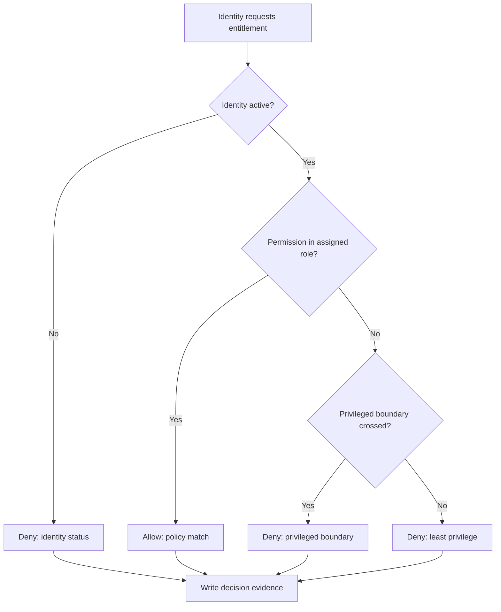
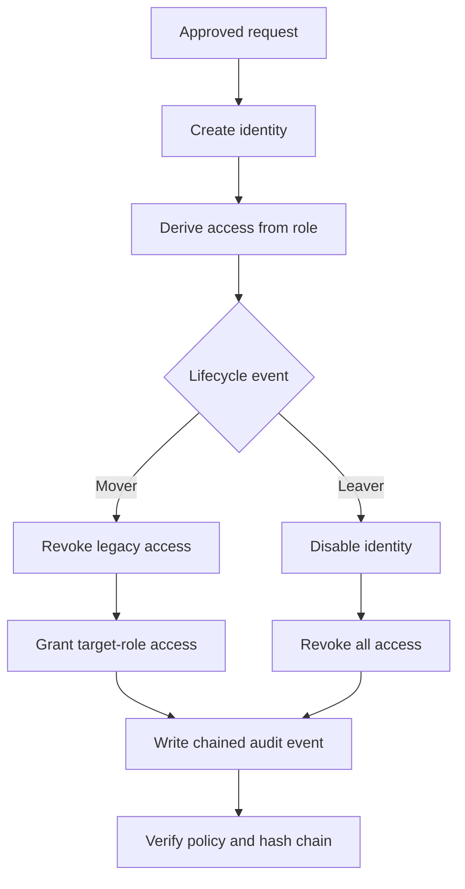

# IdentityShield

IdentityShield is a portfolio-grade identity and access management lab covering the joiner–mover–leaver lifecycle and role-based access control. It demonstrates how an IAM analyst can provision identities, replace legacy access during a role change, design least-privilege job roles, test authorization decisions, block toxic permission combinations, and produce evidence that the controls operated correctly.

> This project uses synthetic identities and permissions. It is an educational security lab, not a production identity provider.

## Lab 01 — User Lifecycle Management

The working lifecycle lab includes:

- policy-based user onboarding with no direct entitlement grants;
- role transfers that calculate and display access additions and removals;
- revoke-before-grant enforcement during a transfer;
- account offboarding that disables the identity and removes all effective access;
- orphaned-permission detection after every lifecycle action;
- persistent identities, roles, permissions, and audit events;
- a SHA-256 hash chain that exposes audit-log modification;
- downloadable JSON evidence for portfolio demonstrations;
- responsive, keyboard-accessible controls and explicit destructive-action confirmation.

## Lab 02 — Least-Privilege Role Engineering

The interactive role-engineering studio applies role-based access control (RBAC) through:

- five department-aligned job roles with one isolated privileged role;
- a controlled catalogue of 23 standard, sensitive, and privileged entitlements;
- an exact role-to-permission matrix that exposes every approved binding;
- server-side authorization tests that return `ALLOW` or `DENY` with a control rationale;
- proposed policy-change evaluation before an entitlement is added to a role;
- department-boundary and privileged-boundary enforcement;
- four segregation-of-duties rules covering finance, people, IAM, and bulk-data risks;
- drift detection between assigned role policy and effective user access;
- persistent decision history and downloadable JSON evidence.

### RBAC Decision Flow



## Control Flow



## Security Decisions Demonstrated

| Control | Implementation |
| --- | --- |
| Least privilege | Users receive only the permission set defined by their role; unmapped requests are denied. |
| No access accumulation | A transfer replaces the old permission set instead of merging it. |
| Revoke before grant | Removed permissions are calculated and recorded before target access is applied. |
| Complete offboarding | Status, role assignment, and effective access are cleared together. |
| Access drift detection | Effective permissions are compared with the current role policy. |
| Segregation of duties | Toxic permission pairs are blocked before a role policy can be expanded. |
| Privileged boundary | Administrative entitlements cannot be added to standard workforce roles. |
| Department boundary | New entitlements must belong to the role's department or an approved shared service. |
| Audit integrity | Every event contains the previous event hash and its own SHA-256 digest. |
| Evidence retention | Lifecycle events and RBAC decisions remain available without retaining user access. |

## Architecture

- **Interface:** React 19 and Vinext
- **Application routes:** server-side lifecycle API
- **Persistence:** Cloudflare D1
- **Data access:** Drizzle ORM with generated SQL migrations
- **Integrity:** Web Crypto SHA-256 hash chaining
- **Deployment:** Cloudflare Worker-compatible server output

The main records are `roles`, `users`, `audit_events`, and `access_decisions`. Role permissions and effective user access are stored independently so the lab can detect entitlement drift. Authorization tests and proposed role changes are retained as separate evidence records.

## API Actions

`GET /api/identity-lab` returns the current identities, approved roles, recent audit events, integrity result, and control metrics.

`POST /api/identity-lab` supports:

- `add_user`
- `transfer_role`
- `offboard_user`

Every state-changing action performs server-side validation and writes a new chained audit event.

`GET /api/rbac-lab` returns the role catalogue, entitlement matrix, identities, segregation-of-duties rules, policy metrics, and recent decision evidence.

`POST /api/rbac-lab` supports:

- `test_access`
- `evaluate_change`

Both RBAC actions are evaluated on the server and persisted with the decision, rationale, and control identifier.

## Demonstration Scenario

1. Add a synthetic employee using an approved role.
2. Select the employee and move them to a different role.
3. Review the exact permissions removed and added.
4. Apply the transfer and confirm orphaned access remains zero.
5. Offboard the employee and verify all permissions are revoked.
6. Confirm the ledger reports a valid hash chain and export the evidence.

For Lab 02:

1. Select each job role and inspect its approved permission set.
2. Review the exact matrix to confirm access is not shared across unrelated roles.
3. Test an in-role entitlement and confirm an `ALLOW` decision.
4. Test an administrative entitlement against a standard role and confirm `DENY`.
5. Propose `payments.release` for the Finance Specialist role and confirm `SOD-FIN-01` blocks it.
6. Export the authorization decision history as evidence.

## Local Development

Requirements: Node.js 22.13 or newer.

```bash
npm ci
npm run dev
```

Generate a migration after changing `db/schema.ts`:

```bash
npm run db:generate
```

Quality checks:

```bash
npm run lint
npm test
```

## Roadmap

- Lab 03: sign-in risk analytics and identity-threat detections
- Lab 04: privileged account separation, approval, and session monitoring
- Portfolio evidence pack with screenshots, architecture notes, and an incident-style case study

## Why This Project Exists

Most IAM demos stop after assigning a role. IdentityShield focuses on the control failures employers actually care about: access accumulation, incomplete offboarding, orphaned permissions, and weak audit evidence. The interface makes each control decision visible so the project can be evaluated by both technical reviewers and hiring managers.
